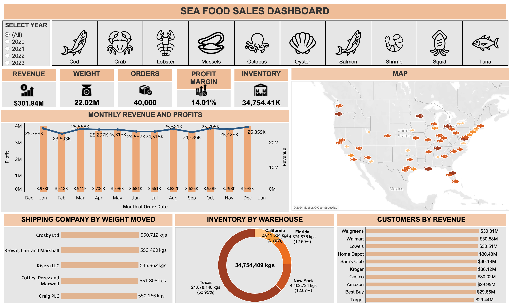

# Seafood Sales Dashboard

Welcome to the Seafood Sales Dashboard repository! This project provides a detailed analysis of seafood sales data using interactive visualizations. Gain insights into key performance indicators (KPIs), revenue splits, seasonality, shipping classifications, customer segmentation, and inventory management.

## Dashboard Preview



## Overview

The Seafood Sales Dashboard delivers an in-depth view of seafood sales performance and addresses key business questions:

1. **Performance Overview**: Track major KPIs such as revenue, weight moved, total orders, profit margin, and inventory to assess overall performance.
   
2. **Geographical Analysis**: Explore the distribution of product sales across various cities and states.

3. **Seasonal Trends**: Understand seasonality in revenue and profit to recognize patterns and plan strategies accordingly.

4. **Shipping Classification**: Classify shipping companies based on the weight moved for each product to optimize logistics.

5. **Customer Segmentation**: Segment customers by the revenue generated for each product to effectively target high-value customers.

6. **Inventory Management**: Monitor inventory levels across warehouses to ensure efficient supply chain management.

## Data Description

The dataset includes the following columns:

- **Product**: Name of the seafood product.
- **Order ID**: Unique identifier for each order.
- **Item Processing Cost**: Cost associated with processing the item.
- **Weight**: Weight of the item in kilograms.
- **Revenue**: Total revenue generated from the item.
- **Profit**: Profit earned from selling the item.
- **Warehouse**: Location where the item is stored.
- **Inventory**: Quantity of the item in stock.
- **Customer**: Name of the customer.
- **City**: City where the customer is located.
- **State**: State where the customer is located.
- **Shipping Company**: Company responsible for shipping the item.
- **Order Date**: Date when the order was placed.
- **Cost per Unit**: Cost per unit of the item.
- **Profit Margin**: Margin between revenue and cost per unit.
- **Average Order Size**: Average size of orders.
- **Inventory Turnover**: Rate at which inventory is sold and replaced.

## Usage

To use the dashboard:

1. Clone this repository:
   ```bash
   git clone https://github.com/yourusername/seafood-sales-dashboard.git
